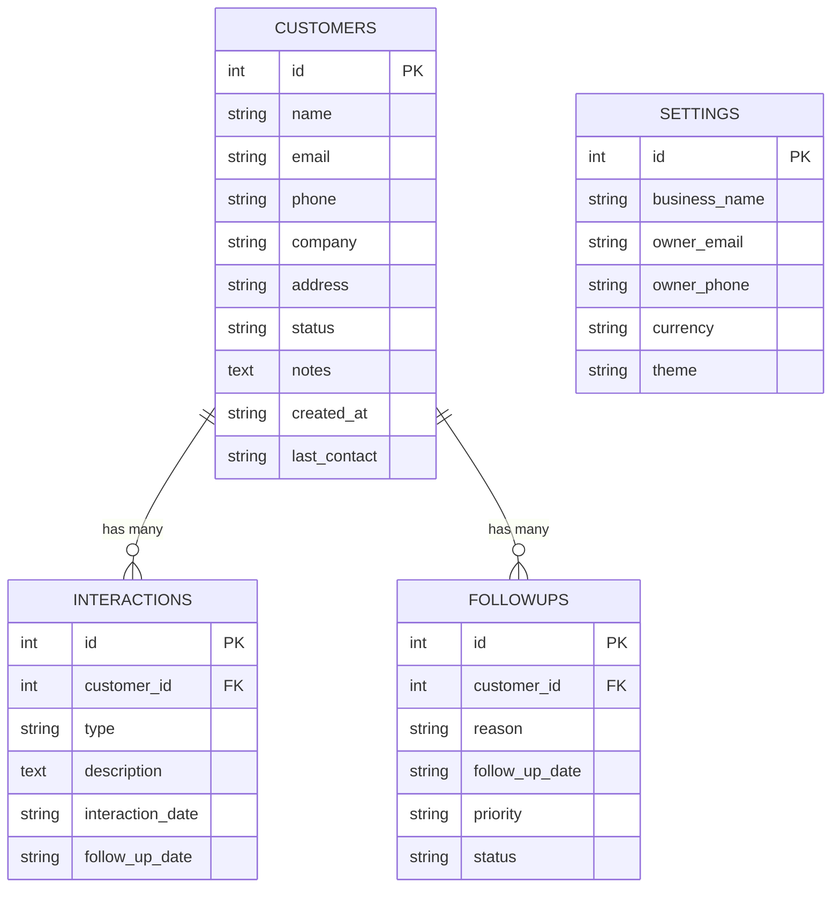

# CRM — Customer Relationship Management System
> **A Clean, Modern Python Mini Project for College Students**  
> *Subtitle: Simple Customer Management for Small Businesses*

---

## 1. Project Title & Overview
**CRM** is a lightweight, responsive web-based Customer Relationship Management system engineered specifically for small businesses (such as retail shops, distributors, consulting agencies, and freelance service providers). It allows business owners to organize client contact directories, track multi-channel communication histories (calls, meetings, emails, WhatsApp messages), manage upcoming follow-up schedules, and view business analytics in real-time.

The application has been purposely designed with a **clean modular structure using Python 3, Flask, and SQLite3**, making every single line of code easy to explain during a practical exam or college viva.

---

## 2. Problem Statement
Small and medium businesses frequently struggle to manage customer communications and sales leads:
- Contact information is often scattered across paper notebooks, spreadsheets, and personal phone chat logs.
- Missed follow-ups result in lost sales opportunities and poor client retention.
- Lack of simple statistical visibility prevents owners from knowing which leads are active, pending, or neglected.
- Commercial enterprise CRM software (like Salesforce or HubSpot) is prohibitively expensive, steep in learning curve, and overly complicated for small business owners.

---

## 3. Objective
To develop an intuitive, accessible, and low-cost CRM system that:
1. Centralizes customer records and business contact details in an encrypted local database.
2. Tracks interaction timelines and notes across calls, emails, and meetings.
3. Provides automated follow-up reminders with priority queues.
4. Generates instant graphical reports on client pipeline distribution and communication channels.
5. Adheres to clean software engineering practices (Separation of Concerns: MVC pattern with Models, Views, and Controllers).

---

## 4. Key Features
- **Modern SaaS-Style Dashboard**: Summary KPI cards (Total Customers, Active Accounts, Pending Follow-ups, Total Interactions), recent client activity list, and upcoming priority reminders.
- **Full Customer Management (CRUD)**:
  - Add new customers with real-time field validation.
  - View full client profile cards with complete historical activity logs.
  - Edit existing customer details dynamically.
  - Delete customer records with safety confirmation modals and cascading deletion.
- **Search & Filter Engine**:
  - Live client-side instant filtering as you type.
  - Server-side multi-field search across Name, Company, Email, and Phone.
  - Status filter tabs: `All`, `Active`, `Pending`, `Inactive`.
- **Interaction History Logging**:
  - Log touchpoints categorized by channel: Phone Call, Email, In-Person Meeting, WhatsApp, or Other.
  - Automatic update of the customer's `last_contact` timestamp.
  - Optional one-click scheduling of subsequent follow-ups directly from the interaction modal.
- **Follow-up Reminders & One-Click Toggle**:
  - Task scheduler with priority badges (`High`, `Medium`, `Low`).
  - One-click `Done / Reopen` status toggle.
  - Live updates reflected in the main dashboard KPI cards.
- **Analytical Reports & Charts**:
  - Visual distribution of Customers by Status (Active / Pending / Inactive).
  - Bar chart of Interaction Channel Usage.
  - Priority breakdown for scheduled follow-ups.
  - Built-in graceful pure-CSS fallback if offline during presentation without internet.
- **Viva Demo Reset Utility**: One-click re-seeder in Settings that restores 10 realistic Indian business client profiles, 15+ interactions, and 11 follow-ups for live viva demonstration.

---

## 5. Technologies Used

| Layer | Technology | Rationale / Purpose |
| :--- | :--- | :--- |
| **Language** | **Python 3.10+** | Readable, clean syntax, easy for college students to explain. |
| **Backend Framework** | **Flask 3.x** | Lightweight micro-framework with zero enterprise bloat. |
| **Database Engine** | **SQLite3** | Zero-configuration, serverless, relational DB built into standard library. |
| **Templating Engine** | **Jinja2** | Seamless server-side HTML rendering with filters and inheritance. |
| **Frontend Styling** | **Vanilla CSS3** | Custom SaaS indigo palette, responsive grid/flexbox, no heavy UI dependencies. |
| **Frontend Behavior** | **Vanilla JavaScript (ES6)** | Modal management, client-side table search, responsive mobile sidebar. |
| **Data Visualizations** | **Chart.js + SVG Fallback** | Clean client-side canvas charts with an offline fallback. |

---

## 6. System Requirements
- **Operating System**: Windows 10/11, macOS, or Linux.
- **Python Version**: Python 3.8 or higher.
- **Web Browser**: Any modern browser (Google Chrome, Microsoft Edge, Mozilla Firefox, Safari).
- **Disk Space**: Less than 25 MB (extremely lightweight).

---

## 7. Project Directory Structure
The project strictly follows the standard Python Flask project layout:

```text
smallbiz_crm/
│
├── app.py                     # Main application factory, registers blueprints & filters
├── database.py                # Database connection helper, DDL schema, & sample data seeder
├── models.py                  # Clean data access layer (SQL queries & CRUD operations)
├── routes.py                  # Controllers handling HTTP requests, validations & redirects
├── requirements.txt           # Python dependency specification (Flask)
├── smallbiz.db                # SQLite3 relational database file (auto-generated)
├── README.md                  # Comprehensive documentation and viva presentation guide
│
├── templates/                 # Jinja2 HTML templates
│   ├── base.html              # Layout shell with sidebar, topbar, modals & flash alerts
│   ├── dashboard.html         # Main dashboard with KPI cards & recent activity
│   ├── customers.html         # Customer directory with search, filter tabs & modals
│   ├── customer_details.html  # Single customer profile & interaction history timeline
│   ├── followups.html         # Follow-up reminders with priority badges & toggle actions
│   ├── interactions.html      # Comprehensive communication activity log
│   ├── reports.html           # Graphical charts & pipeline analytics
│   └── settings.html          # Business info preferences & sample data re-seed tool
│
└── static/                    # Client-side static assets
    ├── css/
    │   └── style.css          # Modern SaaS CSS with responsive design & color variables
    └── js/
        └── script.js          # Interactive modals, live search, and Chart.js renderer
```

---

## 8. Database Architecture & Schema Design
The relational database consists of 4 tables connected by Foreign Key relationships:



### Foreign Key Cascade Rules:
When a customer is deleted, `ON DELETE CASCADE` automatically cleans up all associated interactions and follow-ups, preventing orphaned records and maintaining database integrity.

---

## 9. How CRUD Works in This Project

CRUD represents the four fundamental operations of persistent storage:

1. **Create (C)**:
   - User inputs data into an HTML form.
   - Form data is submitted to Flask via `POST /customers/add`.
   - Backend executes parameterized SQL:  
     `INSERT INTO customers (name, email, phone, company, address, status, notes, created_at, last_contact) VALUES (?, ?, ?, ?, ?, ?, ?, ?, ?);`
2. **Read (R)**:
   - When the user visits `/customers`, Flask executes:  
     `SELECT * FROM customers ORDER BY id DESC;`
   - Records are passed to Jinja2 and dynamically rendered into table rows.
3. **Update (U)**:
   - The user clicks **Edit**; JavaScript populates the form modal.
   - Submitting triggers `POST /customers/edit/<id>`, executing:  
     `UPDATE customers SET name = ?, email = ?, phone = ?, company = ?, address = ?, status = ?, notes = ? WHERE id = ?;`
4. **Delete (D)**:
   - User clicks the trash icon; a safety confirmation modal prompts the user.
   - Submitting triggers `POST /customers/delete/<id>`, executing:  
     `DELETE FROM customers WHERE id = ?;`

---

## 10. Step-by-Step Installation & Execution Guide

### Step 1: Open Terminal / Command Prompt
Navigate to the project folder:
```bash
cd C:\Users\adnan\.gemini\antigravity\scratch\smallbiz_crm
```

### Step 2: (Optional) Activate the Virtual Environment
If using a virtual environment:
```powershell
# On Windows PowerShell:
.\.venv\Scripts\Activate.ps1

# On Windows Command Prompt (cmd):
.\.venv\Scripts\activate.bat
```

### Step 3: Install Dependencies
```bash
pip install -r requirements.txt
```

### Step 4: Run the Application
```bash
python app.py
```

### Step 5: Open in Web Browser
Open your browser and navigate to:  
👉 **`http://127.0.0.1:5000/`**

---

## 11. Recommended Viva Demonstration Flow (For Professors)
Follow this exact sequence during your college viva demonstration:

1. **Open Dashboard (`/dashboard`)**:
   - Point out the 4 KPI cards: Total Customers, Active Customers, Pending Follow-ups, Total Interactions.
   - Show recent customers and upcoming scheduled reminders.
2. **Navigate to Customers (`/customers`)**:
   - Demonstrate the instant live search bar by typing a name like `"Aarav"` or `"Sharma"`.
   - Click the status tabs (`Active`, `Pending`, `Inactive`) to show quick filtering.
3. **Add a New Customer**:
   - Click the prominent **`+ Add Customer`** button.
   - Enter name `"Vikram Malhotra"`, email `"vikram@example.com"`, phone `"9876543211"`, company `"Malhotra Tech"`.
   - Submit and point out the green success flash alert and instant table update.
4. **Inspect Customer Profile (`/customers/<id>`)**:
   - Click **View** on the new customer.
   - Show contact info, member since date, and empty interaction timeline.
5. **Log an Interaction**:
   - Click **`+ Add Interaction`**, choose `Meeting`, enter notes `"Demonstrated software features and pricing proposal"`, set a follow-up date for next week.
   - Submit and show how the interaction is logged and the customer's `Last Contact` timestamp updates.
6. **Manage Follow-ups (`/followups`)**:
   - Navigate to Follow-ups; show the newly scheduled reminder with priority badge.
   - Click **`✓ Done`** to mark it as Completed. Show that the status changes immediately.
7. **Return to Dashboard**:
   - Show that the Pending Follow-ups count decreased by 1 and Total Interactions increased.
8. **Open Reports (`/reports`)**:
   - Explain the 3 visual charts: Customers by Status, Interaction Channels, and Follow-up Priority.
   - Point out that all data is calculated dynamically using SQL aggregate functions.

---

## 12. How to Explain This Project in Viva (Q&A Preparation)

### Q1: What is a CRM and why is it important?
> **Answer**: CRM stands for Customer Relationship Management. It is a system that helps businesses manage interactions with current and potential customers. Instead of keeping customer contacts and notes in disorganized notebooks or chat apps, a CRM centralizes everything into a searchable database so no sales lead or follow-up is forgotten.

### Q2: Why did we choose a CRM for our Python mini project?
> **Answer**: A CRM is a classic, practical real-world application. It perfectly demonstrates:
> 1. Complete **CRUD operations** (Create, Read, Update, Delete).
> 2. **Relational database concepts** (One-to-Many relationships between Customers, Interactions, and Follow-ups).
> 3. Form handling, input validation, and secure query execution in Python.
> 4. Dynamic frontend-backend communication using Flask and Jinja2 templates.

### Q3: What real-world problem does CRM solve?
> **Answer**: Most small business owners cannot afford complex systems like Salesforce, which cost thousands of dollars per month and require extensive training. Our CRM project provides a free, zero-overhead, lightweight alternative tailored to daily small business workflows.

### Q4: Why did we choose Python and Flask over Django or Node.js?
> **Answer**: Python is clear, readable, and part of our computer science curriculum. We chose Flask because it is a micro-framework that does not hide what is happening behind complex boilerplate. In Flask, route handling, request parsing, and database transactions are explicit and easy to trace line-by-line during a code review.

### Q5: Why SQLite instead of MySQL or PostgreSQL?
> **Answer**: SQLite is serverless, zero-configuration, and built directly into Python's standard library (`sqlite3`). The entire database resides in a single portable file (`smallbiz.db`). This makes the project 100% self-contained—an examiner can run the project on any computer without installing or configuring external database servers.

### Q6: What is CRUD and where is it implemented in the code?
> **Answer**: CRUD stands for Create, Read, Update, Delete. In our project:
> - **Create**: `create_customer()` in `models.py` uses `INSERT INTO customers ...`.
> - **Read**: `get_customers()` in `models.py` uses `SELECT * FROM customers ...`.
> - **Update**: `update_customer()` in `models.py` uses `UPDATE customers SET ...`.
> - **Delete**: `delete_customer()` in `models.py` uses `DELETE FROM customers WHERE id = ...`.

### Q7: How are SQL injection attacks prevented?
> **Answer**: We avoid string concatenation like `f"SELECT * FROM customers WHERE name = '{name}'"`. Instead, we use parameterized queries with `?` placeholders:  
> `cursor.execute("SELECT * FROM customers WHERE id = ?", (customer_id,))`.  
> The SQLite database driver safely sanitizes input values before execution.

### Q8: How does the search and filter mechanism work?
> **Answer**: 
> 1. On the frontend, client-side JavaScript listens to the `input` event on the search box and instantly toggles `row.style.display` to filter rows without a page reload.
> 2. On the backend, `models.get_customers(search_query, status_filter)` builds dynamic SQL using `LIKE ?` pattern matching across Name, Company, Email, and Phone fields, combined with exact matching for Status.

### Q9: How does foreign key cascading work in SQLite?
> **Answer**: In `database.py`, we explicitly execute `PRAGMA foreign_keys = ON;`. The `interactions` and `followups` tables have foreign keys with `ON DELETE CASCADE`. When a customer is deleted, SQLite automatically deletes all related interaction records and follow-ups in the same transaction.

### Q10: How are reports and analytics generated?
> **Answer**: In `models.py`, the `get_reports_data()` function uses SQL aggregation:
> `SELECT status, COUNT(*) AS count FROM customers GROUP BY status;`  
> The backend aggregates these counts into Python dictionaries, passes them to `reports.html`, and Chart.js draws the visual doughnut, bar, and pie charts.

---

## 13. Future Scope
If this project is expanded into a final-year major project, the following enhancements could be added:
1. **User Authentication & Role-Based Access Control**: Login for managers vs. sales staff.
2. **Email & WhatsApp Integration**: Direct one-click messaging via Twilio or SMTP.
3. **Data Export/Import**: Export customer contact lists to Excel/CSV and import backups.
4. **PDF Quotation Generator**: Generate branded PDF invoices directly from customer profiles.
